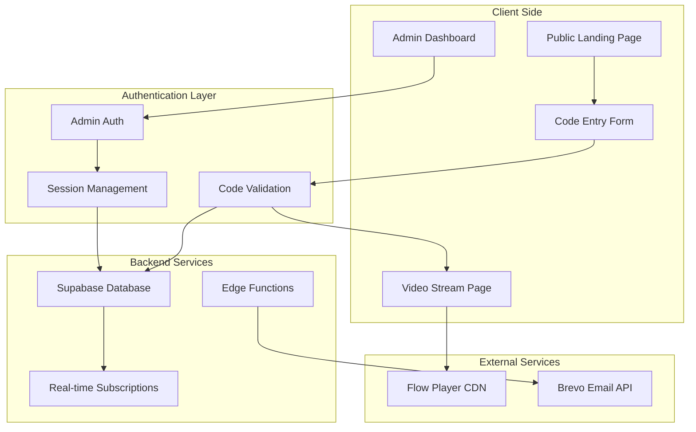
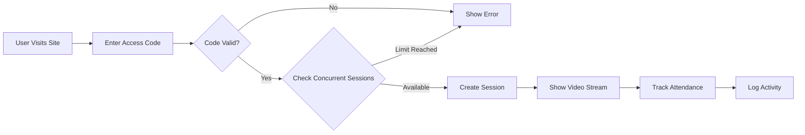

# STPPL UK and Europe - Event Streaming Platform Architecture

## Event Details
- **Event Name**: STPPL UK and Europe
- **Dates**: August 14-17, 2025 (Thursday to Sunday)
- **Platform Type**: Live streaming with code-based authentication

## Technology Stack

### Core Framework
- **Next.js 14** with App Router
- **TypeScript** for type safety
- **React 19** for UI components

### Database & Backend
- **Supabase** (PostgreSQL)
  - Built-in authentication system
  - Real-time subscriptions for live updates
  - Row Level Security (RLS) for data protection
  - Edge Functions for serverless operations

### Styling & UI
- **Tailwind CSS** for utility-first styling
- **Shadcn/ui** for modern, accessible components
- **Framer Motion** for smooth animations

### Email Service
- **Brevo (Sendinblue)** for transactional emails

### Video Streaming
- **Flow Player** (embed integration)

### Additional Libraries
- **React Hook Form** for form handling
- **Zod** for schema validation
- **TanStack Query** for data fetching
- **date-fns** for date manipulation
- **Recharts** for attendance analytics

## System Architecture



## Database Schema

### Tables

#### 1. `admin_users`
```sql
- id (UUID, Primary Key)
- email (Text, Unique, Not Null)
- password_hash (Text, Not Null)
- role (Text, Default: 'admin')
- created_at (Timestamp)
- updated_at (Timestamp)
```

#### 2. `access_codes`
```sql
- id (UUID, Primary Key)
- code (Text, Unique, Not Null)
- type (Enum: 'center', 'individual')
- name (Text) -- Center/Individual name
- email (Text)
- max_concurrent_sessions (Integer, Default: 1)
- is_active (Boolean, Default: true)
- created_by (UUID, Foreign Key -> admin_users)
- created_at (Timestamp)
- expires_at (Timestamp, Nullable)
```

#### 3. `sessions`
```sql
- id (UUID, Primary Key)
- code_id (UUID, Foreign Key -> access_codes)
- session_token (Text, Unique)
- ip_address (Text)
- user_agent (Text)
- started_at (Timestamp)
- last_activity (Timestamp)
- ended_at (Timestamp, Nullable)
- is_active (Boolean, Default: true)
```

#### 4. `attendance_logs`
```sql
- id (UUID, Primary Key)
- code_id (UUID, Foreign Key -> access_codes)
- session_id (UUID, Foreign Key -> sessions)
- date (Date)
- login_time (Timestamp)
- logout_time (Timestamp, Nullable)
- duration_minutes (Integer, Nullable)
```

#### 5. `email_logs`
```sql
- id (UUID, Primary Key)
- code_id (UUID, Foreign Key -> access_codes)
- email_type (Text)
- recipient_email (Text)
- sent_at (Timestamp)
- status (Text)
- brevo_message_id (Text)
```

## Key Features Implementation

### 1. Code-Based Authentication System
- **Center Codes**: Single concurrent session enforcement
- **Individual Codes**: Multiple concurrent sessions allowed
- Session token generation and validation
- Automatic session cleanup for inactive users

### 2. Concurrent Session Management
```typescript
// Pseudo-code for session validation
async function validateSession(code: string, sessionToken?: string) {
  const accessCode = await getAccessCode(code);
  
  if (accessCode.type === 'center') {
    // Check for existing active sessions
    const activeSessions = await getActiveSessions(accessCode.id);
    if (activeSessions.length >= 1 && !sessionToken) {
      throw new Error('Center code already in use');
    }
  } else {
    // Individual code - check max concurrent sessions
    const activeSessions = await getActiveSessions(accessCode.id);
    if (activeSessions.length >= accessCode.max_concurrent_sessions) {
      throw new Error('Maximum concurrent sessions reached');
    }
  }
  
  return createSession(accessCode.id);
}
```

### 3. Admin Dashboard Features
- **Code Management**
  - Generate bulk codes (centers/individuals)
  - Set concurrent session limits
  - Enable/disable codes
  - Set expiration dates
  
- **Email Management**
  - Send access codes via Brevo
  - Email templates for different user types
  - Bulk email sending
  
- **Analytics & Reporting**
  - Real-time attendance tracking
  - Daily attendance reports
  - Session duration analytics
  - Export data to CSV

### 4. User Flow



## Security Considerations

1. **Row Level Security (RLS)** in Supabase
2. **Session tokens** with JWT encryption
3. **Rate limiting** on code entry attempts
4. **IP-based blocking** for suspicious activity
5. **HTTPS only** deployment
6. **Environment variables** for sensitive data
7. **CORS configuration** for API endpoints

## Deployment Strategy

### Recommended Platforms
1. **Vercel** (Optimal for Next.js)
   - Automatic deployments
   - Edge functions support
   - Global CDN

2. **Alternative: Railway/Render**
   - Full-stack deployment
   - Database hosting included

### Environment Variables Required
```env
# Supabase
NEXT_PUBLIC_SUPABASE_URL=
NEXT_PUBLIC_SUPABASE_ANON_KEY=
SUPABASE_SERVICE_ROLE_KEY=

# Brevo
BREVO_API_KEY=
BREVO_SENDER_EMAIL=

# App Config
NEXT_PUBLIC_APP_URL=
JWT_SECRET=
```

## Performance Optimizations

1. **Static Generation** for landing pages
2. **Dynamic imports** for admin dashboard
3. **Image optimization** with Next.js Image
4. **Database indexing** on frequently queried columns
5. **Redis caching** for session management (optional)
6. **CDN for video streaming** via Flow Player

## Monitoring & Analytics

1. **Vercel Analytics** for performance metrics
2. **Sentry** for error tracking
3. **Custom dashboard** for business metrics
4. **Supabase dashboard** for database monitoring

## Timeline Estimation

- **Week 1**: Project setup, database schema, authentication
- **Week 2**: Admin dashboard, code management
- **Week 3**: Video streaming integration, attendance tracking
- **Week 4**: Email integration, testing, deployment

## Next Steps

1. Set up Supabase project
2. Initialize Next.js application
3. Create database schema
4. Implement authentication system
5. Build admin dashboard
6. Integrate video player
7. Set up email service
8. Deploy to production